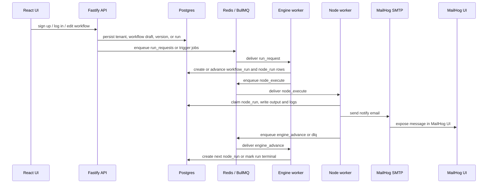
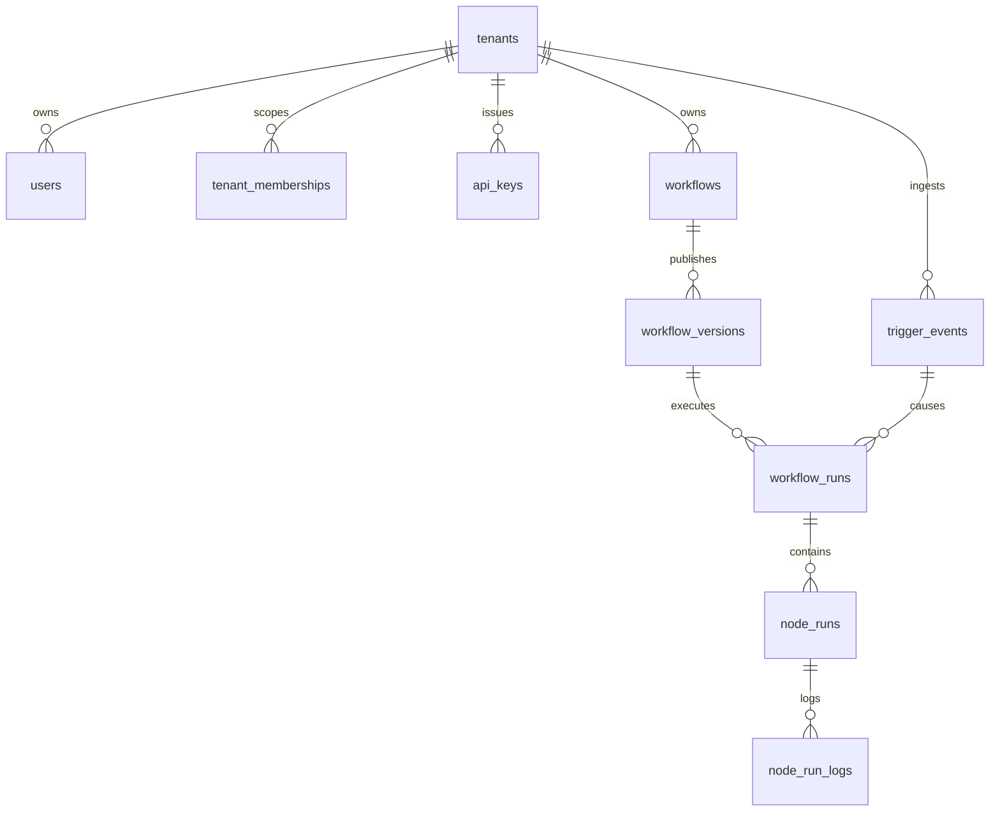

# Flow (MVP)

Flow is a multi-tenant workflow orchestration platform with a production-style backend, a React UI, Postgres as the source of truth, Redis/BullMQ for delivery, and MailHog for local email inspection.

This repository is intentionally structured so you can explain the system end to end:

- how a tenant is created and authenticated,
- how a workflow draft becomes an immutable published version,
- how a trigger becomes a durable run,
- how node execution is claimed, executed, retried, and advanced,
- how Postgres, Redis, BullMQ, and MailHog fit together,
- how to demo and debug the system in a technical interview or live review.

## What lives in this repo

- `services/api/` - Fastify HTTP API, auth, workflows, runs, triggers, DLQ, and dev helper endpoints.
- `services/engine/` - BullMQ worker that turns run requests into execution state and advances the workflow graph.
- `services/worker/` - BullMQ worker that executes nodes, writes logs, handles retries, and sends notifications.
- `services/scheduler/` - Cron poller that scans published workflow versions and emits scheduled run requests.
- `ui/` - Vite + React workflow builder, run monitor, and auth UI.
- `migrations/` - SQL migrations that define the durable data model.
- `scripts/dev/` - seeders and smoke tests for demos and local validation.

## Local prerequisites

- Docker Desktop
- Node.js 20+ and npm 10+
- Optional but useful: `psql` and `redis-cli` for live debugging during the demo

## Quick start

### 1. Start the infrastructure and services

```bash
docker compose -f infra/compose.yaml up -d --build
```

This starts:

- Postgres on `localhost:55432`
- Redis on `localhost:6379`
- MailHog SMTP on `localhost:1025`
- MailHog UI on `localhost:8025`
- Adminer on `localhost:8080`
- API on `localhost:3000`
- Engine worker, node worker, and scheduler containers

### 2. Run migrations

```bash
npm run db:migrate
```

### 3. Start the UI

```bash
cd ui
npm install
npm run dev
```

The UI reads `VITE_API_BASE_URL` if the API is not on `http://localhost:3000`.

## Running from source without Docker

If you want to run the backend services directly during development:

```bash
npm install
cd ui && npm install
```

Then in separate terminals:

```bash
npm run api:dev
npm run engine:dev
npm run worker:dev
```

And for schedules:

```bash
node services/scheduler/src/cli.mjs
```

The scheduler uses `DATABASE_URL` and `REDIS_URL`, plus optional `SCHEDULER_POLL_MS` and `SCHEDULER_RELOAD_MS`.

## Environment variables

The main env file is `.env.example`.

Required or commonly used variables:

- `DATABASE_URL` - Postgres connection string
- `REDIS_URL` - Redis connection string used by BullMQ
- `SMTP_HOST` and `SMTP_PORT` - MailHog or SMTP endpoint for notification delivery
- `HTTP_NODE_ALLOWED_HOSTS` - comma-separated host allowlist for `http_request`
- `HTTP_NODE_TIMEOUT_MS` - timeout for HTTP node execution
- `HTTP_NODE_MAX_RESPONSE_BYTES` - max bytes read from HTTP responses
- `AUTH_RATE_LIMIT_PER_MINUTE` - authenticated tenant rate limit
- `AUTH_PUBLIC_RATE_LIMIT_PER_MINUTE` - public auth/webhook rate limit

## Architecture at a glance



The design rule is simple:

- Postgres is truth.
- Redis/BullMQ is delivery.
- Queues may replay or duplicate.
- The database constraints make the system correct anyway.

## The data model

Flow uses Postgres tables to make orchestration durable and debuggable.

### Core tables

- `tenants` - one row per workspace / org boundary.
- `users` - users belong to one tenant.
- `tenant_memberships` - role mapping for `owner`, `editor`, and `viewer`.
- `api_keys` - hashed API tokens for authenticated API access.
- `workflows` - mutable draft workflow definitions.
- `workflow_versions` - immutable published snapshots of a workflow.
- `trigger_events` - deduped trigger ingress for webhook and schedule triggers.
- `workflow_runs` - one durable state machine per execution.
- `node_runs` - one durable state machine per node execution attempt.
- `node_run_logs` - append-only logs per node run.

### Schema invariants that matter

- `tenants.slug` is unique.
- `users` are unique per `(tenant_id, email)`.
- `workflow_versions` are unique per `(workflow_id, version)`.
- `trigger_events` are unique per `(tenant_id, source, dedupe_key)`.
- `workflow_runs` are unique per `(tenant_id, workflow_version_id, trigger_event_id)`.
- `node_runs` are unique per `(workflow_run_id, node_id)`.
- `api_keys.token_hash` is unique and only hashes are stored.

### Why these constraints exist

- They prevent duplicate trigger ingestion.
- They prevent duplicate run creation from the same trigger.
- They prevent the same logical node from being scheduled twice.
- They make at-least-once delivery safe.

### ERD



## Queue topology

Flow uses BullMQ with four logical queues:

- `run_requests` - trigger and manual-run requests that should become workflow runs.
- `node_execute` - individual node execution jobs.
- `engine_advance` - follow-up jobs that inspect a completed node and create the next node run.
- `dlq` - final failures that need operator inspection.

### How the queues fit together

1. A schedule or webhook creates a `workflow_run` and enqueues `run_requests`.
2. The engine consumes `run_requests`, ensures the run is `RUNNING`, creates the entry `node_run`, and enqueues `node_execute`.
3. The worker consumes `node_execute`, claims the node, executes it, writes logs and output, then enqueues `engine_advance`.
4. The engine consumes `engine_advance`, picks the next edge based on outcome, creates the next `node_run`, or marks the run terminal.
5. If a node exhausts retries or fails a non-retryable check, the worker writes the terminal failure and places a payload in `dlq`.

## What happens when a node is created

This is the most important mental model in Flow.

1. In the UI, adding a node updates `workflows.draft_graph` as JSONB.
2. Saving the draft updates the mutable `workflows` row only. Nothing executes yet.
3. Publishing copies the graph into an immutable `workflow_versions.graph` row.
4. When a run starts, the engine materializes the first `node_runs` row for the entry node.
5. The worker claims that row from `READY` to `IN_PROGRESS`.
6. The node-specific handler executes and writes `output`, `outcome`, and logs.
7. The worker emits `engine_advance`.
8. The engine reads the completed node, resolves the next edge, and creates the next `node_runs` row.
9. The process repeats until the run reaches `SUCCEEDED`, `FAILED`, or `CANCELLED`.

That is the durable state machine in practice.

## Runtime flows end to end

### 1. Tenant signup and login

Signup is not just authentication. It bootstraps a tenant.

#### Register

`POST /v1/auth/register`

Request body:

```json
{
  "tenant": { "slug": "acme", "name": "Acme" },
  "user": {
    "name": "Owner",
    "email": "owner@acme.test",
    "password": "Password123!"
  }
}
```

What happens:

- a tenant row is created,
- a user row is created,
- a tenant membership with `owner` role is created,
- a bootstrap API key is created,
- a starter workflow and starter version are created for the tenant.

Response includes:

- `tenant`
- `user`
- `role`
- `api_key`

#### Login

`POST /v1/auth/login`

Request body:

```json
{
  "tenant_slug": "acme",
  "email": "owner@acme.test",
  "password": "Password123!"
}
```

What happens:

- credentials are checked against the tenant-specific user record,
- a new API key is minted,
- the response returns `tenant`, `user`, `role`, and `api_key`.

#### Authenticated identity

`GET /v1/auth/me`

Returns the current tenant/user identity plus role.

### 2. Drafting a workflow

`POST /v1/workflows` creates a workflow shell.

`PATCH /v1/workflows/:workflowId` updates the draft graph.

The draft graph lives in `workflows.draft_graph` and remains mutable.

Important node config contracts in the draft graph:

- `delay` uses `config.seconds`.
- `http_request` uses `config.method`, `config.url`, and optional `headers`, `body`, `url_context_path`, `headers_context_path`, and `body_context_path`.
- `condition` uses `config.base`, `config.path`, `config.op`, and `config.value`.
- `notify` uses `config.provider`, `config.to`, `config.subject`, `config.text` or `config.body`, and optional `config.context_path`.

### 3. Publishing a workflow

`POST /v1/workflows/:workflowId/publish`

What happens:

- the current draft graph is copied into `workflow_versions.graph`,
- the published version gets a monotonically increasing version number,
- the version becomes immutable.

This is the point where you can say, "what ran is now frozen forever."

### 4. Manual run flow

Manual runs are implemented.

1. Create the run from a published version:

   `POST /v1/workflows/:workflowId/versions/:versionId/runs`

   This inserts a `workflow_runs` row with `status = PENDING` and a `NULL trigger_event_id`.

2. Start it:

   `POST /v1/runs/:runId/start`

   This transitions the run to `RUNNING` and enqueues `run_requests`.

3. The engine consumes the queue and creates the entry `node_run`.

This is the manual path you can show live in a demo.

### 5. Webhook trigger flow

Webhook triggers are implemented.

`POST /v1/triggers/webhooks/:workflowId/:secret`

What happens:

- the workflow is loaded,
- the secret is validated against `draft_graph.trigger.webhook_secret`,
- the latest published version is selected,
- a `trigger_events` row is inserted with `source = webhook`,
- a `workflow_runs` row is inserted or reused via the uniqueness constraint,
- a `run_requests` job is enqueued,
- the API returns `202 Accepted`.

The caller may send `X-Flow-Dedupe-Key` to control dedupe. If absent, the request ID is used.

### 6. Scheduled trigger flow

The scheduler service is a separate runtime component.

It:

- loads published workflow versions with `trigger.schedule_cron` or legacy `trigger.cron`,
- parses cron schedules,
- creates a `trigger_events` row with `source = schedule`,
- inserts or reuses a `workflow_runs` row,
- enqueues `run_requests`.

This is what you use when someone asks, "how do scheduled automations work?"

### 7. Node execution flow

The worker service consumes `node_execute` jobs.

#### Claiming work

- a node must move from `READY` to `IN_PROGRESS`,
- the claim is protected by DB locking and state transitions,
- duplicate queue delivery is safe because the worker re-checks the DB.

#### Supported node handlers

- `delay`
  - waits using a delayed BullMQ job and `queued_at + seconds` semantics,
  - writes `output.delayed_seconds`,
  - logs the completion,
  - enqueues `engine_advance`.

- `http_request`
  - validates `http:` or `https:`,
  - enforces host allowlisting,
  - applies timeout and max response bytes,
  - supports context-driven URL, headers, and body fields,
  - stores response metadata and logs the request,
  - treats non-2xx as retryable.

- `condition`
  - evaluates `path` against either `input` or the full `context`,
  - compares with `eq`, `neq`, `gt`, `gte`, `lt`, `lte`, or `contains`,
  - stores a boolean `outcome` of `true` or `false`,
  - logs the decision and advances along the matching edge.

- `notify`
  - currently uses the `email` provider,
  - sends mail through MailHog SMTP in local environments,
  - supports `context_path` for context-derived message content,
  - logs the message ID and delivery result.

#### Retry and DLQ behavior

- transient errors become `FAILED_RETRYABLE`,
- retries use exponential backoff,
- final failures become `FAILED_FINAL`,
- the worker emits a DLQ job for operator review,
- the engine then propagates the terminal failure to the workflow run.

### 8. Engine advancement flow

The engine service consumes `engine_advance` jobs.

It:

- loads the completed `node_run`,
- locks the parent `workflow_run`,
- checks whether the run is still active,
- reads the workflow graph from `workflow_versions.graph`,
- picks the next edge using the node outcome,
- creates the next `node_runs` row, or marks the run terminal if no edge remains,
- enqueues the next `node_execute` job.

This is the step where you can say: the queue only delivers work, but the DB decides what happens next.

### 9. Failure and DLQ flow

Failure handling is explicit.

Common failure cases:

- HTTP host not allowlisted,
- HTTP timeout,
- invalid node config,
- unsupported node type,
- exhausted retries,
- notify send failure,
- invalid graph entry node,
- workflow run canceled or paused while work is in flight.

What happens:

- the node run is marked terminal,
- a structured error is written to `node_runs.error`,
- a log record is added to `node_run_logs`,
- a DLQ job is created for owner inspection,
- the run is eventually marked `FAILED` if a terminal node failure is present.

## API contract

The API is versioned under `/v1`.

### Public and auth endpoints

- `GET /healthz` - liveness check.
- `GET /readyz` - readiness check that confirms database connectivity.
- `GET /v1/tenants` - list tenants.
- `POST /v1/tenants` - create a tenant.
- `POST /v1/auth/register` - create tenant, owner user, and bootstrap API key.
- `POST /v1/auth/login` - mint a new API key for an existing tenant user.
- `GET /v1/auth/me` - read the authenticated identity.
- `POST /v1/auth/api-keys` - create an additional API key for the current tenant.

### Workflow endpoints

- `GET /v1/workflows`
- `POST /v1/workflows`
- `GET /v1/workflows/:workflowId`
- `PATCH /v1/workflows/:workflowId`
- `POST /v1/workflows/:workflowId/publish`
- `GET /v1/workflows/:workflowId/versions`
- `GET /v1/workflows/:workflowId/versions/:versionId`
- `POST /v1/workflows/:workflowId/versions/:versionId/runs`

### Run endpoints

- `GET /v1/runs`
- `GET /v1/runs/:runId`
- `GET /v1/runs/:runId/node-runs`
- `GET /v1/runs/node-runs/:nodeRunId/logs`
- `POST /v1/runs/:runId/start`
- `POST /v1/runs/:runId/pause`
- `POST /v1/runs/:runId/resume`
- `POST /v1/runs/:runId/cancel`

### Trigger, engine, worker, and DLQ endpoints

- `POST /v1/triggers/webhooks/:workflowId/:secret`
- `POST /v1/engine/tick`
- `POST /v1/workers/claim`
- `POST /v1/workers/execute/:nodeRunId`
- `GET /v1/dlq`
- `POST /v1/dlq/:jobId/resolve`

### Request contract notes

- Authenticated routes accept `Authorization: Bearer <API_KEY>` or `x-api-key: <API_KEY>`.
- If `x-tenant-id` is present, it must match the authenticated token tenant.
- The API enforces role-based write access:
  - `viewer` can read,
  - `editor` can create/update workflows and control runs,
  - `owner` can also resolve DLQ items and mint extra API keys.
- Auth and webhook routes are rate limited per IP.
- Authenticated routes are rate limited per tenant.

## Operational notes

For quick debugging, the most useful checks are:

- Postgres rows for `tenants`, `workflows`, `workflow_versions`, `trigger_events`, `workflow_runs`, `node_runs`, and `node_run_logs`.
- Redis queue keys for `run_requests`, `node_execute`, `engine_advance`, and `dlq`.
- MailHog UI at http://localhost:8025 for the email notify path.

The technical presenter script has been moved to [`TEMP.md`](TEMP.md).

## Useful smoke and seed scripts

- `npm run dev:seed:tenant` - create a demo tenant.
- `npm run dev:seed:e2e` - seed a workflow and a published version for end-to-end demos.
- `npm run test:e2e:backend` - backend smoke test.
- `npm run test:e2e:schedule` - schedule and MailHog end-to-end smoke test.

The schedule smoke test validates a graph like:

- `delay` -> `http_request` -> `condition` -> `notify`

and proves that schedule-triggered runs can reach MailHog.

## API and UI commands

Root package scripts:

- `npm run db:migrate`
- `npm run db:status`
- `npm run db:reset`
- `npm run db:new`
- `npm run api:dev`
- `npm run api:build`
- `npm run engine:dev`
- `npm run engine:build`
- `npm run worker:dev`
- `npm run worker:build`
- `npm run test:e2e:backend`
- `npm run test:e2e:schedule`

UI scripts:

- `cd ui && npm run dev`
- `cd ui && npm run build`
- `cd ui && npm run preview`

## Why Docker-first

We want a reproducible environment that behaves like deployment:

- Postgres has a persistent volume.
- Redis has a persistent volume.
- API, engine, worker, and scheduler are isolated service processes.
- The demo environment is close to the production shape.

## Reference docs

- `docs/00-correctness-contract.md`
- `docs/01-migrations-and-db-primer.md`
- `ONE_PAGER.md`
- `DETAILED_ARCHITECTURE.md`

If you are explaining the system to a technical audience, start with `ONE_PAGER.md`, then move into `DETAILED_ARCHITECTURE.md`, and keep this README open as the operational and demo guide.
